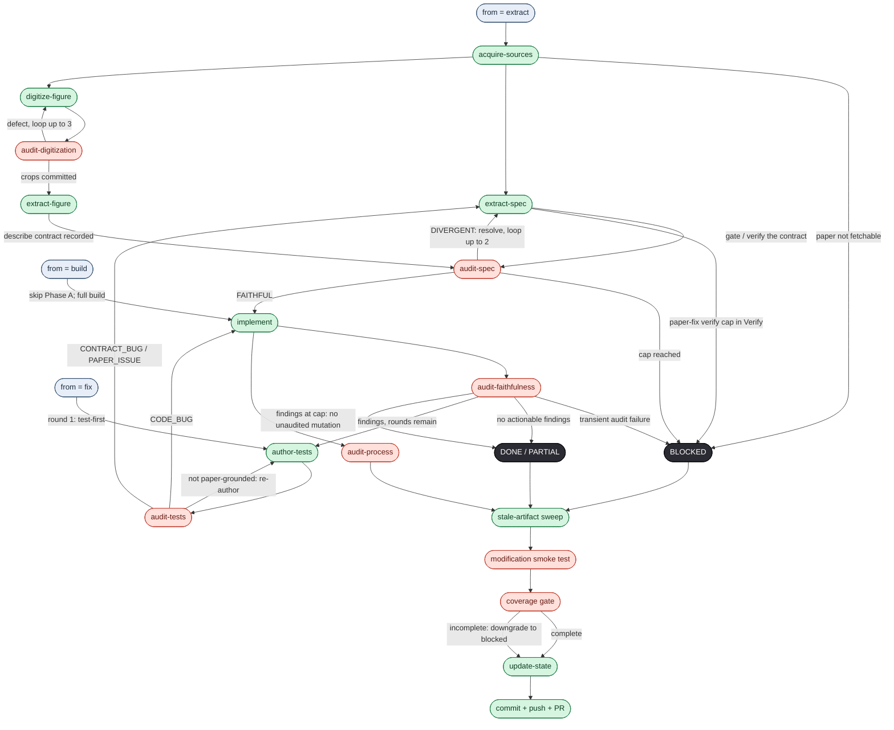

# full-pass — the agent graph

The `full-pass` reproduction workflow (`.claude/workflows/full-pass.js`) as a
directed graph: **every agent appears exactly once**, and the caps/retries are
drawn as **loops** (back-edges). It is the visual companion to
[WORKFLOW.md](WORKFLOW.md).

> **Keep this in sync.** Any change to the workflow — to [WORKFLOW.md](WORKFLOW.md)
> *or* to `.claude/workflows/full-pass.js` (a node, an edge, a loop, a cap, a
> routing rule) — **must be reflected in the graph below.** The graph and the prose
> are two views of one process; if they disagree, that is a bug to fix, not a
> nuance to leave.

Green = build/author agents · red = independent auditors (an auditor never audits
its own output). The reused agents collapse to a single node each: `extract-spec`
(extractor **and** the paper-fix *resolver*), `audit-spec` (the Phase-A *gate*
**and** the paper-fix *verifier*), and `implement` (initial build **and** the
verify-loop fix).

## The loops (caps guarantee termination)
- `digitize-figure ⇄ audit-digitization` — re-digitize on defect (≤ 3).
- `extract-spec ⇄ audit-spec` — the **paper-fix**: resolve from ground truth
  (code → lineage → human), then independently verify (≤ 2). Still divergent at the
  cap → **BLOCKED**.
- `author-tests ⇄ audit-tests` — re-author until the tests are paper-grounded (not
  tautologies).
- `implement → audit-faithfulness → author-tests → audit-tests → implement` — the
  verify loop (≤ 3 rounds); `audit-faithfulness` is **comprehensive — everything vs
  the paper**. If the final audit round still has actionable findings, the workflow
  records them and exits without applying an unaudited final-round mutation.

Every finalized exit — `DONE`, `PARTIAL`, `BLOCKED`, or an error — funnels through the
stale-artifact sweep → modification smoke test → coverage gate → `update-state`
(README + a "👉 DECISION NEEDED" human entrypoint when blocked/flagged) → `commit +
push + PR`, without exception.
